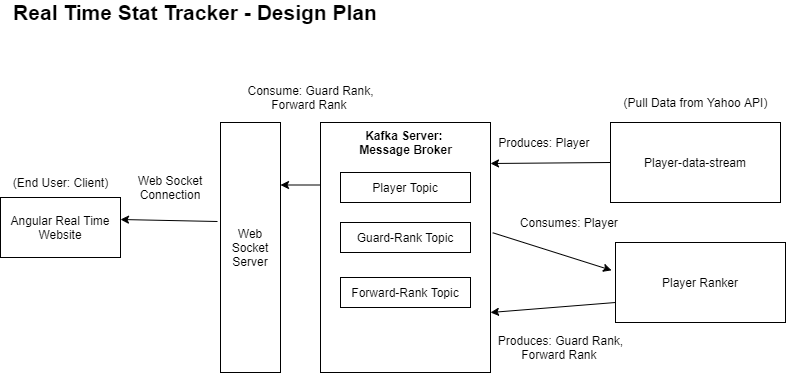

# nba-stat-tracker

A distributed system used to analyze NBA player stats to better predict well preforming players to help draft into your fantasy teams.

## Tech Stack

Apache Kafka (Message Brokers)
Java 8
JSON Messages
Web Socket Servers
Angular 10

## Plan

## Setup

Run consumers from most dependent to least

1. Run web socket client
2. Run player-ranker
3. Run player-data-stream  

## API for Data
https://sportsdata.io/developers/api-documentation/nba#/team-stats

Author: Renuchan Thambirajah
